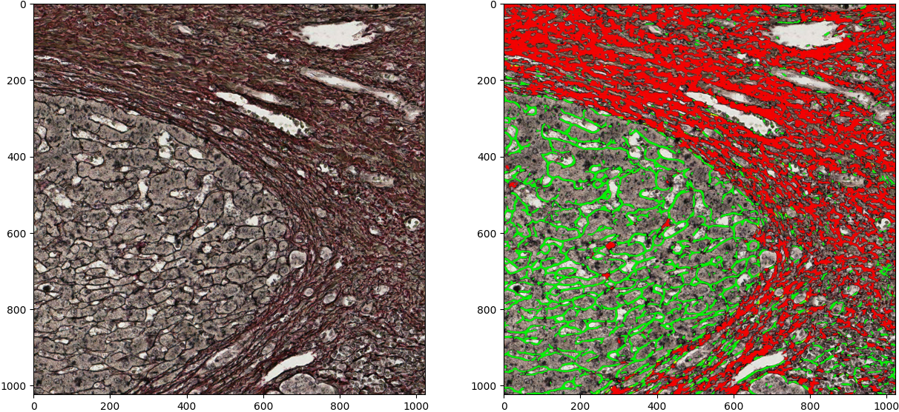
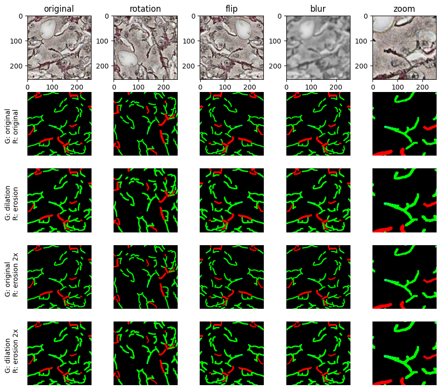

# Summary
This is a legacy code. No updates are planned.

A robust and affordable method for assessing biological information of fibrous collagen architecture from readily available bright-field microscopy images.

This repository holds the Python code necessary to:
* build and train a model based on modified U-Net architecture
* perform segmentation of collagen framework from bright-field histology images
* extract a set of image-based features of fiber morphometry, density, orientation, and texture

This repo does not cover:
* generating ground truth for model training and evaluation

## Principle
This is an updated version of a method used in a publication: "Tumor collagen framework from bright-field histology images predicts overall survival of breast carcinoma patients."[^collagen_paper]

Due to its complex structure and abundance in the connective tissue, fibrous collagen is quite challenging to annotate precisely. However, this can still be done with less precision, more of a subjective, rough, expert-dependent view of the task - by manually outlining fibers in bright-field histology images. Our paper [^collagen_paper] describes two ways to generate ground truth - fully-manual and semi-automated.

For the segmentation task, we employ the U-Net as a base model (with certain modifications). Examples given in this repo were obtained by a model designed to target a specific tumor type - hepatocellular carcinoma (HCC). In this experiment, two types of fibers were segmented - fibrous collagen and reticulin fibers (see Fig.1).

Fig.1. Two types of HCC fibers detected by the trained model - reticulin in green, and collagen in red.

## Model
The architecture employed is a U-net[^U-net_paper]. It has five levels and a so-called "bottleneck" block in each level on the encoder path. We first used this block to better segment nuclei in a Kaggle competition [^Kaggle_DSBowl_2018] and a lymphocyte paper [^lymphocyte_paper]. The input shape of the model is 256 x 256 x 3; the output has a 256 x 256 pixel-sized image plane and the number of channels in the output can be tuned according to the requirements.

## Dataset
Since the model can be tuned to target as many classes of objects as needed, accordingly these types of objects have to be annotated in ground truth masks. In Fig.2 you can see an example of a manually annotated patch:


Fig.2. Some simple augmentations applied - rotation, flipping, blurring, zooming, and different amount of annotation erosion and dilation applied to one image patch.

The saved dataset of images (X_train) and ground truth masks (Y_train) is meant to be stored in an hdf5 file[^hdf5] with the following structure:
```python
dataset.h5/
├── X_train # shape = (N, 256, 256, 3), type = ('ndarray', dtype('float64'))
└── Y_train # shape = (N, 256, 256, 3), type = ('ndarray', dtype('float64'))

where N =  number of images.
```
Here we have a model constructed with three output channels - explicitly for visualization purposes (so that the model outputs an RGB image readily available for viewing). Accordingly, we have three-channel ground truth masks with a collagen mask in the R channel, a reticulin mask in the G channel, and an empty B channel.

# Imports/Dependencies
Most recent setup that worked:
```python
h5py == 3.7.0
numpy == 1.23.4
tensorflow == 2.11.0
tensorboard == 2.11.0
```

# Usage
* Use yor own approach to generate ground truth masks and store the dataset.
* Build, train, and save the model (see `./train_fiber_model.py` file for reference).
    * To monitor the training start tensorboard:
    `tensorboard --logdir ./Graph --host localhost --port 6006`
* Load trained model and process new images (see `./run_fiber_extraction.py` file for reference).
* Read patches from saved fiber masks and produce morphometry features (see `./calculate_features.py` file for reference).


[^collagen_paper]: [Morkunas, M., Zilenaite, D., Laurinaviciene, A. et al. Tumor collagen framework from bright-field histology images predicts overall survival of breast carcinoma patients. Sci Rep 11, 15474 (2021).](https://doi.org/10.1038/s41598-021-94862-6)
[^U-net_paper]: [Ronneberger, O., Fischer, P., Brox, T. U-net: Convolutional networks for biomedical image segmentation. arXiv:1505.04597 (2015)](https://doi.org/10.48550/arXiv.1505.04597)
[^Kaggle_DSBowl_2018]: [2018 Data Science Bowl: Find the nuclei in divergent images to advance medical discovery](https://www.kaggle.com/competitions/data-science-bowl-2018)
[^lymphocyte_paper]: [Budginaitė, E., Morkūnas, M., Laurinavičius, A. and Treigys, P., Deep learning model for cell nuclei segmentation and lymphocyte identification in whole slide histology images. Informatica, 32(1) (2021).](https://doi.org/10.15388/20-INFOR442)
[^hdf5]: [h5py user manual](https://docs.h5py.org/en/stable/)
